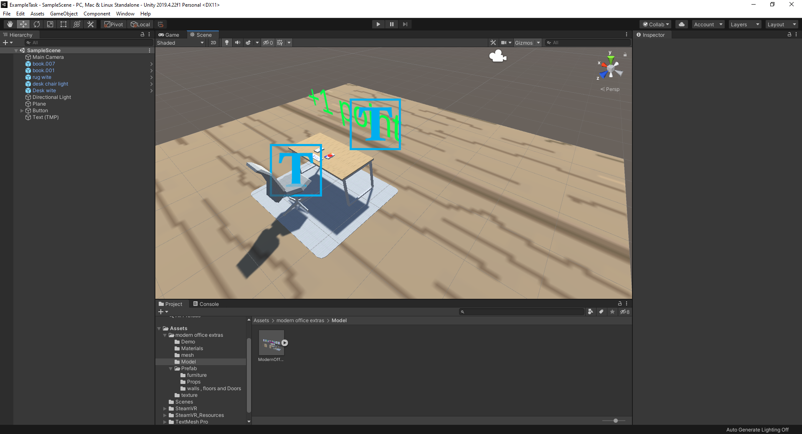
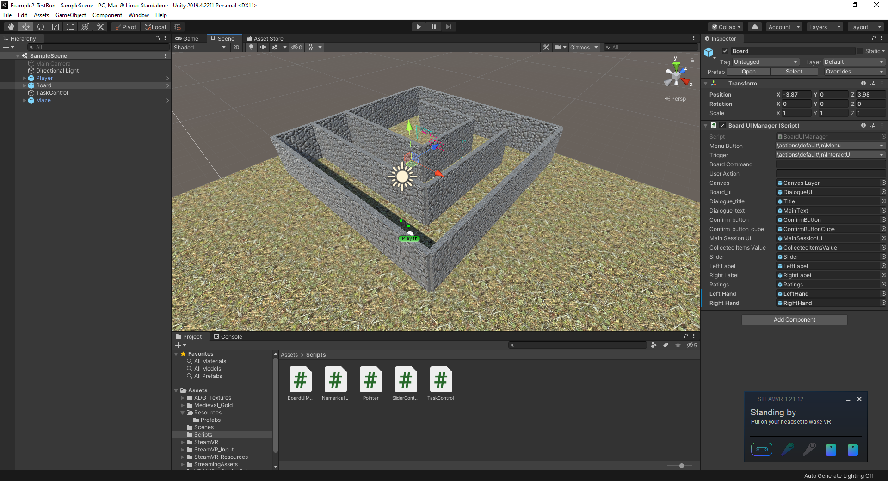
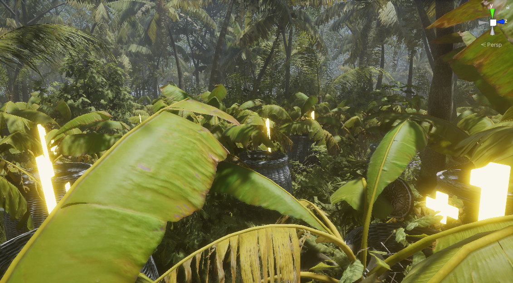
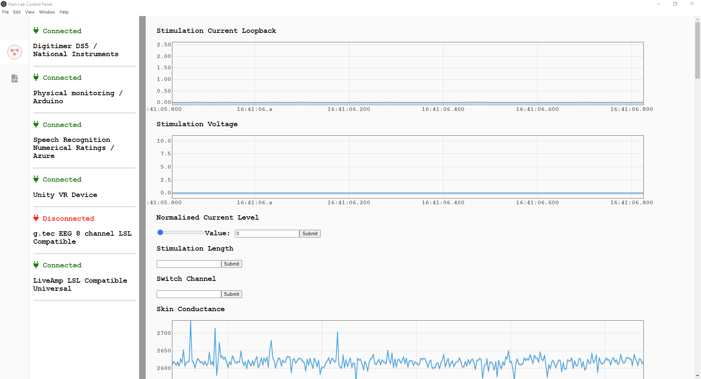
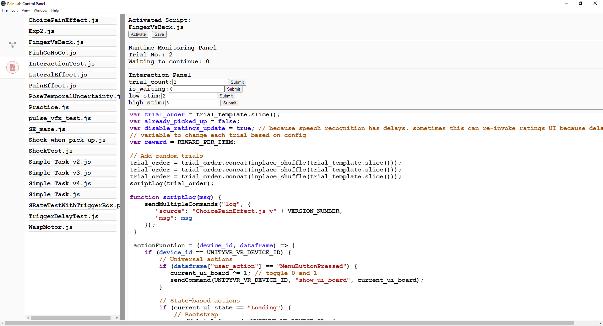

# A guide to set up virtual reality experiments

## Table of Contents
- [A guide to set up virtual reality experiments](#a-guide-to-set-up-virtual-reality-experiments)
  - [Table of Contents](#table-of-contents)
  - [Overview](#overview)
    - [What are the new things in VR compared to sitting in front of a traditional computer screen](#what-are-the-new-things-in-vr-compared-to-sitting-in-front-of-a-traditional-computer-screen)
    - [What are the challenges/differences of a VR experiment](#what-are-the-challengesdifferences-of-a-vr-experiment)
- [Part 1: Simple Task Setup](#part-1-simple-task-setup)
  - [Preparation](#preparation)
    - [Hardware](#hardware)
    - [Software](#software)
  - [Example - Simple Bandit Task](#example---simple-bandit-task)
    - [Steps](#steps)
  - [Example - Physical foraging task in a maze](#example---physical-foraging-task-in-a-maze)
    - [Steps](#steps-1)
  - [Example - Realistic rendering environment](#example---realistic-rendering-environment)
- [Part 2 Linking other data streams](#part-2-linking-other-data-streams)
  - [Collecting and saving more data streams](#collecting-and-saving-more-data-streams)
    - [Collect data in Unity](#collect-data-in-unity)
      - [Motion tracking data](#motion-tracking-data)
      - [Eye tracking data](#eye-tracking-data)
      - [Bluetooth heart rate monitor](#bluetooth-heart-rate-monitor)
      - [Kinect](#kinect)
    - [Collect data outside Unity](#collect-data-outside-unity)
  - [Apply stimulation feedback](#apply-stimulation-feedback)
  - [Closed-loop task control with ad-hoc scripts](#closed-loop-task-control-with-ad-hoc-scripts)

## Overview

Virtual reality (VR) is a new technology that brings new ways of presenting visual stimuli and interaction with a virtual environment, which makes it valuable for designing novel experimental paradigms. This guide is intended to help researchers with some experience setting up computer-based experiments (e.g. Psychopy, Psychtoolbox etc.) to get started with VR experiments.

### What are the new things in VR compared to sitting in front of a traditional computer screen

VR has been studied for many years. Enormous engineering effort has been put into making the virtual experience more realistic. Current VR technology advances might be categorized into two topics: vision and interaction. Vision is benefit from the fast-developing computer graphics technology, for example, faster graphics processing and algorithm render virtual environment to realistic visual stimuli, and higher pixel density makes it possible to present a high-resolution image on the screen of a wearable headset. Interaction advances are probably attributed to more robust and simpler motion-tracking technology. Interactions are done by interacting with virtual objects in 3D space. This is much more natural than using a mouse and a keyboard.

### What are the challenges/differences of a VR experiment

In terms of the actual development, as we will see shortly, VR games use the same development platform as other non-VR games. It only changes two things: the way it outputs graphics (binocular vision) and the way of interaction (motion capture and controllers). A game engine or the VR manufacturer's software package usually does most of the things for us. What more important to us is VR's realistic experience can cause some necessary changes to existing paradigms.

- VR environments and all objects within are 3D. If you want to present a 2D cue, it needs to be on some plane in 3D. You would always allow the vision rotates when people rotate their head, otherwise, it can cause dizziness. Therefore, the 3D spatial location of a cue relative to the subject is important.
- VR experiments usually run continuously. In a monitor-based task, a cue displays on a screen, and the subject presses a key. In VR, instead of pressing a key instantly, it can take a certain amount of time to complete an action. For example, reaching an object in a go/no-go task with real arm movement does not complete instantly but rather a continuous action.

One can always fall back to using a VR headset as a big screen, and all interaction is done by pressing keys. In that case, it might be easier to run a monitor-based task rather than seeking to use VR.

# Part 1: Simple Task Setup
## Preparation

### Hardware

VR headset: There are two main-stream VR headsets. One is PC-based and the headset is essentially a display. HTC Vive is the main manufacturer of PC-based VR. The other one is a standalone headset which the headset has a mobile operating system installed. Standalone headsets have generally poorer performance when running on their own, but they can be connected to PCs and acts as a display for PC VR as well. We currently use HTC Vive Pro Eye for lab experiments. It was the only headset with built-in eye-tracking functionality when we made the purchase. However, more companies are developing high-end VR headsets now. Recently released Pico 4 Enterprise and Meta Quest Pro are also equipped with eye tracking. We are keen to test their possibility to be used in the lab environment. Pico 4 Enterprise and Meta Quest Pro are both standalone headsets.

We still prefer to use PC-based VR, not only because PC is more powerful but also PC can handle other data streams from other devices better (for example, EEG data). VR applications usually require good graphics hardware to run the game. Hardware updates frequently, so here we only show our currently running lab PC's specifications.

- CPU: Intel 11900KF
- GPU: NVIDIA RTX 3090 24GB
- Memory: 64GB DDR4
- Storage: 1TB SSD

Other lab/clinical equipment that was used previously in conventional experiments is usually applicable. The biggest issue is probably whether the device is portable and has acceptable motion artifacts when used with VR.

### Software

Operating system: We would recommend using Windows 10 / 11 operating system.

Game engine: VR environment is inherently 3D. Therefore, a 3D game engine could be a great platform to develop VR applications. Game engines are productivity software with many tools to help develop games efficiently. Popular publicly accessible 3D game engines with VR integration support include [Unity](https://unity.com/), [Unreal](https://www.unrealengine.com/en-US), and [CryEngine](https://www.cryengine.com/). All three are free to use with licenses for non-commercial use. Unity is probably the easiest one to start among all three. We use **Unity 2019.4 LTS** for our current studies. It would be best to follow [Unity's official tutorials](https://learn.unity.com/) if you are new to game development.

SteamVR: [SteamVR](https://store.steampowered.com/app/250820/SteamVR/) is a widely used VR development and runtime software. SteamVR provides software development kits for developers to make VR games in Unity and other game engines. It also provides useful interaction libraries to develop VR games quickly. SteamVR is developed by Valve Corporation who owns a major video game distribution platform Steam. Therefore, if you want to obtain a copy of SteamVR, you need to download it through Steam. If you download SteamVR through Steam, whenever you launch SteamVR, Steam would launch automatically. However, if you are registered as a business user of Valve's hardware partner HTC Vive, you can obtain an offline version of SteamVR through Vive. 

SteamVR has not been updated for a while. As more players come to the VR industry, we could see a more diverse VR ecosystem.

## Example - Simple Bandit Task
The first example is a simple bandit task where participants are asked to pick one book on the desk. Different books give different rewards.
### Steps

1. **Assets import**: From asset store import [SteamVR](https://assetstore.unity.com/packages/tools/integration/steamvr-plugin-32647), [pixel modern office extras](https://assetstore.unity.com/packages/3d/environments/urban/pixel-modern-office-extras-225670).
2. **Level design**:
   - Create a floor by creating a new plane. You can attach certain textures (e.g. wood) to the plane.
   - Place objects (chairs, desks) from the assets we just imported on the floor.
   - Place player prefab from `SteamVR/InteractionSystem/Core/Prefabs`
3. **UI design**: 
   - Create a trial start button with a cube and a TextMeshPro object (or UI text) and place them on the desk.
   - Create a scoreboard display in front of the desk using TextMeshPro object (or UI text) object.

Figure 1: Unity editor screenshot of the bandit task
1. **Task execution**: Create a new game object called TaskControl, and add [task control script (complete version)](sources/Example1/TaskControl.cs) to the game object as a component. Using a separate script to control the global task progress is a neat way to write the task execution logic. This task is simple. The participant touches the start button, then the options (books) are now available to be chosen. Once the participant picks a choice (by touching the book), reward points is displayed in front of them. The start button is now available to be pressed again. We do this step by step.

   - Everything starts with the participant pressing the button. We use colliders to do this (so in fact it is touching the button rather than pressing the button). So we create a [button pressing script (complete version)](sources/Example1/ButtonPressing.cs) and attach it to the button object so that when the button is touched by hand, `OnCollisionEnter` will be called (if the button has a collider. If not, simply add a box collider to the button game object).
      ```C#
      private void OnCollisionEnter(Collision collision)
        {
            if (!disableButton)
            {
                buttonPressed = true;
                transform.GetChild(0).GetComponent<TextMeshPro>().SetText("Pick one book");
                taskControl.StartButtonPressed();
            }
        }
      ```
      This function does three things: set the button state to pressed which is a member variable that we should define it earlier (see [the complete version](sources/Example1/ButtonPressing.cs)). We also then change the instruction to "Pick one book" shown on the button. Note here we make the text object a child object of the button so that we can find it by calling `transform.GetChild(0)`. There is no other child, so the first one with index 0 is the text object. Lastly, we need to tell the task control script that this button is pressed by calling the public member function `StartButtonPressed` of `TaskControl`.

      We then would like to have some animation effects for the button. When the button is pressed, we would like to have it gradually lowered down to create a 'pressed' feeling. The distance and speed require manual tweaking. It is called in `FixedUpdate` so that it is updated at a constant rate. If you want to rather update it in `Update`, where two calls are called in a variable time interval, you need to calculate the moving distance using time passed since the last frame to ensure the button moves at deterministic speed.
      ```C#
      private void FixedUpdate()
      {
          if (buttonPressed)
          {
              if (originVerticalHeight - gameObject.transform.position.y < verticalMovingDistance)
              {
                  gameObject.transform.position = new Vector3(gameObject.transform.position.x, gameObject.transform.position.y - movingSpeed, gameObject.transform.position.z);
              }
          }
      }
      ```
      The `TaskControl` component then knows the button is now pressed through the function called `StartButtonPressed`, it simply sets a flag indicating it is now in a new trial and it will then handle the book choice correctly.

   - Next, we need another script for each choice (book): [choice handling (complete version)](sources/Example1/ChoiceHandling.cs). It does two things: a. tell `TaskControl` if the hand has collided with a book and which book is in collision with, which means if the participant made a choice, b. highlight the book by changing the material when the hand is in collision with the book. This is done by the following code
      ```C#
      private void OnCollisionEnter(Collision collision)
      {
          taskControl.ObjectSelected(transform.name);
          material.SetColor("_Color", Color.yellow);
      }

      private void OnCollisionExit(Collision collision)
      {
          material.SetColor("_Color", Color.white);
      }
      ```
      Let us go back to `TaskControl.ObjectSelected`. If it is in Trial (after the button is pressed), the reward points is set depending on the choice. Here two choices are associated with deterministically reward, so it is a boring bandit task. If the total trial count `trialCount` exceeds the maximum number of trials `totalTrials`, we will disable the button and the participant won't be able to start a new trial. 
      ```C#
      if (inTrial)
      {
          if (name == "book.001")
          {
              rewardText.SetText("+1 point");
          }
          else
          {
              rewardText.SetText("+0.5 point");
          }
          rewardPopUp.SetActive(true);
          lastRewardPopUp = Time.time;
          inTrial = false;
          button.ResetButtonState();
          trialCount += 1;
          if (trialCount >= totalTrials)
          {
              button.disableButton = true;
          }
      }
      ```
      The reward points pop-up is only shown temporarily. We record the time it is set active, then turn it off after 1 second in the `Update` function.
      ```C#
      void Update()
      {
          if (rewardPopUp.activeSelf)
          {
              if (Time.time - lastRewardPopUp > 1)
              {
                  rewardPopUp.SetActive(false);
              }
          }
      }
      ```
   This completes the whole simple experiment design. Of course, we still need to save the behavioural data and possibly connecting and synchronising with other devices like EEG, which will be covered in part 2. Unfortunately due to [Unity Asset Store EULA](https://unity.com/legal/as-terms), we may not distribute the full project containing Asset Store materials, but you can download a build version here: [Example1_Build](Build/Example1-Build.7z).

## Example - Physical foraging task in a maze
The second task is a maze task where participants navigate through a maze and collect gold bar that is scattered in the maze. 
### Steps

1. **Assets import**: From asset store download and import [HUD for VR - Sterile Future](https://assetstore.unity.com/packages/2d/gui/icons/hud-for-vr-sterile-future-120259), [Outdoor Ground Textures](https://assetstore.unity.com/packages/2d/textures-materials/floors/outdoor-ground-textures-12555), [18 High Resolution Wall Textures](https://assetstore.unity.com/packages/2d/textures-materials/brick/18-high-resolution-wall-textures-12567), [Medieval Gold](https://assetstore.unity.com/packages/3d/props/medieval-gold-14162), [SteamVR](https://assetstore.unity.com/packages/tools/integration/steamvr-plugin-32647).
2. **Level design**: 
    - The maze: You can create a maze by deforming 3d cubes into walls. We provide a very simple maze to download to use as an example: [Maze package](unity_packages/Maze.unitypackage).
    - Player and UI: In this example, we use a virtual dashboard as the main UI for people to interact with. You can download and import our pre-coded UI dashboard here: [Player UI](unity_packages/PlayerUI_NoSteamVRInput.unitypackage). SteamVR input may be not set correctly. To do that, click Window->SteamVR Input. Create a menu binary input if it does not exist. Save and generate. Open Binding UI, and check if all inputs have been assigned. Adjust canvas size if necessary in Board->Canvas Layer->CanvasLocationControl->Canvas.
    - Then place prefabs `Resources/Prefabs/Board` and `Resources/Prefabs/Players` in the scene. Assign properties under Board UI Manager correctly. This includes `Menu Button`, `Trigger`, `Left Hand`, and `Right Hand`. The Left hand and right hand should be from the Player's hands. 
    - Make `Medieval_Gold/i_gnot` a prefab saved in `Resource/Prefabs/1_ignot` by dragging it to the scene and drag to the asset folder.

Figure 2: Unity editor screenshot of the maze task
3. **Task execution**: 
     - Now we have a UI dashboard. It can be turned on/off by pressing the menu button binded to the controller. We can implement this by adding the following code to the `Update` function (See [complete Task control script](sources/Example2/TaskControl.cs)).
        ```C#
        if (UIManager.userAction == "MenuButtonPressed")
        {
            toggleUI ^= 1;
            UIManager.SetBoardDisplay(Convert.ToBoolean(toggleUI));
            UIManager.userAction = "";
        }
        ```
        When the menu button is pressed, the `UIManager.userAction` will be set to "MenuButtonPressed". We check it in every `Update` function call and take action (i.e. change the dashboard display status). We need to reset it back to "". The way we do it is different from conventional UI handling where you process everything in some callback function triggered by a key pressing. It is however more modular and keeps the entire control logic within the `Update` function. This advantage will be more obvious when it comes to our external interactive control interface. 
     - The task is very simple. It consists of two states: `Idle` and `InTrial`. For game design, it is helpful to refer to the [Finite-state machine (FSM)](https://en.wikipedia.org/wiki/Finite-state_machine) as the model. Here, we have two states. When the participant clicks start, the task state transits from `Idle` to `InTrial` and spawn a gold bar for the participant to pick up. When the participant picks up the gold bar, or time is up, the task state goes back to `Idle` again. 
        ```C#
        if (TaskState == "Idle")
        {
            if (UIManager.boardCommand == "ConfirmButtonPressed")
            {
                GenerateItems();
                UIManager.SetBoardDisplay(false);
                toggleUI = 0;
                trialStartTime = Time.time;
                UIManager.boardCommand = "";
                TaskState = "InTrial";
            }
        }
        else if (TaskState == "InTrial")
        {
            bool foundObject = false;
            Player player = Player.instance;
            if (player)
            {
                foreach (Hand hand in player.hands)
                {
                    GameObject attachedObject = hand.currentAttachedObject;
                    if (attachedObject != null)
                    {
                        foundObject = true;
                    }
                }
            }
            
            if (foundObject)
            {
                UIManager.SetBoardDisplay(true);
                UIManager.SetMainText("You found the object! Click to continue");
                toggleUI = 1;
                TaskState = "Idle";
                Destroy(GameObject.Find("goldbar"));
            }

            if ((Time.time - trialStartTime > 60) && !foundObject)
            {
                UIManager.SetBoardDisplay(true);
                UIManager.SetMainText("Time is up! Click to to try again");
                toggleUI = 1;
                TaskState = "Idle";
                Destroy(GameObject.Find("goldbar"));
            }
        }
        ```
4. **Going through walls**: Now we have completed the task execution logic. One might already notice our walls in the virtual world is useless! If you don't have a wall in the real world, then you can go through a wall in the virtual world. Generally, there are three (or four) ways of dealing with this:
    
    1. Avoid using walls. Don't add walls unless you really need to.
    2. Fade the screen to black when hitting the wall.
    3. Use controller buttons to move forward rather than real body movement.
    4. Stop the player's camera going into the wall by adding an offset to the camera if the participant is moving in the wall direction. 
   
   In commercial VR game development, all strategies are used. However, when we are running experiments, it could be better to use one single moving strategy. For example, in a VR game, you are usually allowed to move with controller buttons as well as real body movement. Unless you want to compare people's preference of this two interaction ways, I think in experiments, to keep the behavioural data more controlled, it is better to either use controllers only or use real body movement. 

   **Fade to black on collision**: The key thing here is to overlay a black layer to the screen output. `OpenVR.Compositor` has a function called `FadeToColor` that allows VR compositor to overlay a colour layer on top of the the game visual output. We also ned to detect head collisions with the wall. It is not a good idea to put a collider on the VR camera itself because in Unity the collision can only be detected when there is a rigid body attached to one of the collided objects. We then create a separate game object with a small box collider and non-kinematic rigid body and attach the [following script](sources/Example2/DarkenOnCollision.cs) to it:
   ```C#
    void Update()
    {
        transform.position = Camera.main.transform.position;
    }

    void OnCollisionEnter(Collision collision)
    {
        SteamVR_Fade.View(new Color(0, 0, 0, 0.995f), 0.1f);
    }

    void OnCollisionExit(Collision collision)
    {
        SteamVR_Fade.View(new Color(0, 0, 0, 0), 0.1f);
    }
   ```
   The code will put a 0.5% transparent mask when the head collides with some objects and removes the mask if the collision exits.

   **Movement controlled by hand controller**: Add a character controller component to the Player (tracking origin) game object and attach [this script](sources/Example2/VRController.cs) to activate game object should enable moving in the head direction by pressing the  `squeeze` button on the controller.

   A new problem with this approach is the collision detection is only enabled for the collider created at Player's position. This is not the same as the actual VR headset position unless the participant sits in the centre of the tracking area. We can either ask the participant to sit in the centre of the tracking region we pre-calibrated, or disable the position tracking. To disable tracking, you can make the Player scale extremely small. Or for a more robust solution, if you are using Unity XR mode (at the beginning when you import SteamVR package), change `SteamVR/InteractionSystem/Core/Scripts/Player.cs` line 268, 269 to:
   ```C#
   if (hmd.GetComponent<UnityEngine.SpatialTracking.TrackedPoseDriver>() == null)
    {
        hmd.gameObject.AddComponent<UnityEngine.SpatialTracking.TrackedPoseDriver>();
        // changed this to enable only rotation tracking
        hmd.gameObject.GetComponent<UnityEngine.SpatialTracking.TrackedPoseDriver>().trackingType = UnityEngine.SpatialTracking.TrackedPoseDriver.TrackingType.RotationOnly;
   }
   ```
   which change the `TrackedPoseDriver` to `RotationOnly`, and replace `SteamVR_Behaviour_Pose` component for each hand with the following `Custom_Behaviour_Pose` component:
    ```C#
    using System;
    using System.Threading;
    using System.Collections;
    using System.Collections.Generic;
    using UnityEngine;
    using UnityEngine.Events;

    using Valve.VR;

    public class Custom_Behaviour_Pose : SteamVR_Behaviour_Pose
    {
        public GameObject VRCamera;
        
        protected override void UpdateTransform()
        {
            CheckDeviceIndex();

            if (origin != null)
            {
                Vector3 trackedPosition = poseAction[inputSource].localPosition;
                Vector3 hmdTrackedPosition = VRCamera.GetComponent<UnityEngine.SpatialTracking.TrackedPoseDriver>().trackedPosition;

                transform.position = origin.transform.TransformPoint(trackedPosition - hmdTrackedPosition);
                transform.rotation = origin.rotation * poseAction[inputSource].localRotation;
            }
            else
            {
                transform.localPosition = poseAction[inputSource].localPosition;
                transform.localRotation = poseAction[inputSource].localRotation;
            }
        }
    }
    ```
    One thing to note is once you disable real movements in VR, it is important to make sure participants' heads are still. Moving physically while not moving visually can cause strong motion sickness. 

    **Add offset to the headset**: Another popular solution in VR games is to add offset to the headset if the headset is moving into the virtual wall. However, one problem with this is the offset can add up and it could be too much that the centre of the virtual world is on the edge of the real world. Usually, those games implement a reset feature that resets the virtual centre to the current position. For running experiments, this extra unnatural re-centre feature could be a confounder for the behavioural data depending on the research question of your study.
## Example - Realistic rendering environment

The above examples use Unity standard render pipeline which uses [forward rendering](https://docs.unity3d.com/Manual/RenderingPaths.html). It is fast and friendly to low-performance computers / mobile devices, but the graphics quality is not great. Other render pipeline like [High Definition Render Pipeline (HDRP)](https://docs.unity3d.com/Packages/com.unity.render-pipelines.high-definition@14.0/manual/index.html) uses deferred shading as the default rendering path which gives much better quality but is much more computationally expensive.

Figure 3: Unity editor screenshot of an HDRP rendered environment
One of our experiments in a realistic jungle environment.

# Part 2 Linking other data streams

For this part, we will discuss more things happening outside Unity. For more information and code bases of our software infrastructure, please refer to [PainLabInteractiveControlPanel
](https://github.com/ShuangyiTong/PainLabInteractiveControlPanel).
## Collecting and saving more data streams
Perhaps, one key difference between Unity-based studies and other conventional 2D studies in programming is Unity has higher concurrency and demands higher real-time performance. Conventional experiments have clear steps, something like "displaying cue" -> "subject response" -> "reward/punishment". Unity is running through all active game object's components and each `Update` function should be completed quickly rather than doing something and waiting in PsychoPy. This can be done through asynchronous function calls or multi-threading. 
### Collect data in Unity
To collect data in Unity, one needs to write or utilize packages that read external data into Unity, which is usually C# programming. 
#### Motion tracking data
Point tracking can be added separately with [Vive Tracker](https://www.vive.com/uk/accessory/tracker3/). By attaching a `SteamVR_Behaviour_Pose` component to some game object and correctly configuring Pose input (Note a [SteamVR existing issue](https://steamcommunity.com/app/250820/discussions/4/3949029052301918254/)), the tracking data then can be retrieved from the game object's position.

#### Eye tracking data
With the HTC Vive Pro Eye headset, eye-tracking data can be collected in Unity through [Eye and Facial Tracking SDK](https://developer.vive.com/resources/vive-sense/eye-and-facial-tracking-sdk/). It not only tracks the direction of the eye ball, but also provides real-time pupil sizes. We used this eye tracking data to track what objects participant were currently looking at. You can [download our Unity Prefabs](unity_packages/Eyetracker.unitypackage) here if you have installed the SDK.
#### Bluetooth heart rate monitor
[TODO]
#### Kinect
[TODO]
### Collect data outside Unity
Collecting data outside Unity usually requires some type of communication between Unity and the program collecting the data. Some protocol like [labstreaminglayer](https://github.com/sccn/labstreaminglayer) has Unity package that can help with that. But sometimes, just recording the data from some other external software (e.g. [BrainVision Recorder](https://brainvision.com/products/recorder/)) works as well. The key question is how to synchronize data recorded in a separate software without communicating with Unity. A simple way is to use timestamps. Both Unity and other third-party software records timestamp from the operating system's clock (For researchers who are more familiar with marker synchronization rather than a sequence of timestamps, you can check out [this article by Labstreaminglayer developer](https://labstreaminglayer.readthedocs.io/info/time_synchronization.html)). 

We did develop a series of software aims to resolve this issue in one solution. We developed an application layer simple bi-directional data exchange protocol over TCP (PainLabProtocol). PainLabProtocol is similar to Labstreaminglayer but less sophisticated. Its performance may be poorer compared to other protocols like Labstreaminglayer or more efficient game server protocols over UDP, but it emphasizes data readability (transmit and saved in Javascript) and flexibility in data format. The key software here is an interactive control panel ([PainLabInteractiveControlPanel](https://github.com/ShuangyiTong/PainLabInteractiveControlPanel)). It acts as the server to collect data from different devices that speak PainLabProtocol including [Unity](https://github.com/ShuangyiTong/PainLabDeviceNIDAQDotNet4.5VS2012/blob/master/PainLabDeviceNIDAQDotNet4.5VS2012/PainlabProtocol.cs), [Arduino](https://github.com/ShuangyiTong/PainLabDeviceEmbedded), [NI DAQ](https://github.com/ShuangyiTong/PainLabDeviceNIDAQDotNet4.5VS2012), [Azure speech recognition](https://github.com/ShuangyiTong/PainLabDeviceVoiceRecognitionAzure), and [Brain Products, g.tec LSL connector](https://github.com/ShuangyiTong/PainLabLSLCompatibilityLayerLiveAmp). It is similar to data acquisition software like [BrainVision Recorder](https://brainvision.com/products/recorder/) or [Labrecorder](https://github.com/labstreaminglayer/App-LabRecorder), but it also includes the functionality to send commands to the device and allows you to plug in scripts to control the task easily in real-time.


Figure 4: All in one interactive control panel

Figure 5: Interactive panel controlled by script with ad-hoc parameter modification during experiment
## Apply stimulation feedback

[TODO: simple server/client implementation]

With the interactive control panel, here is a simple example that sends shock every 1 second.
```javascript
const stimulator_id = "SC91BBkyiIWxnJMipKYk";
var last_shocked = Date.now();

actionFunction = (device_id, dataframe) => {
    if (Date.now() - last_shocked > 1000) {
        sendCommand(stimulator_id, "normalised_current_level", 3);
        last_shocked = Date.now();
    }
}
```
In this example, this Javascript script code is driven by `actionFunction`. Whenever there is new data comes in, this `actionFunction` is called. This resembles the `Update` function in Unity. It has two parameters `device_id` and `dataframe`. Users can write code in the `actionFunction` to give feedback based on the data in the `dataframe`. Here we only give shocks to participants based on a timer. In the next section, we will utilize this control panel for more complex data interactions. 
## Closed-loop task control with ad-hoc scripts
[TODO: Migrate Example 2 logic to the control panel]